# ThirdLife Setup Core — Security Data Flow

**Status:** Approved initial model  
**Model revision:** TL-0004 approved 1  
**Draft date:** 2026-08-14  
**Authority:** Supporting analysis for [`threat-model.md`](threat-model.md); binding boundaries remain in the root authority files

**Post-approval maintenance:** 2026-08-21 — `TL-0005` traceability/status annotation only. The approved base remains commit `917b5ebd5f5e4cf273a087a05dd381da54324235`; threats, residual decisions, and security approval were not changed or re-approved.

This document decomposes the planned v0.1 system into external entities, processes, stores, trust boundaries, and numbered flows. It describes intended security properties, not implemented or verified behavior. The tables are the accessible textual equivalent of the diagram.

## Context and non-flows

- ThirdLife Setup Core starts on a sanitized, replaced-storage, or no-donor-storage device with a fresh or known Windows installation.
- Sanitization remains an external prerequisite. Flow `F-01` records bounded evidence about it; there is no erase, wipe, imaging, activation, unlock, MDM removal, or ownership-bypass flow.
- The local operating system and its APIs are not an integrity oracle. Provider output crosses `TB-PROVIDER` before it becomes normalized evidence.
- Approval, privileged mutation, journaling, and independent verification are separate processes and flows.
- B1 has no runtime or data flow to a sibling product or future B4 adapter. `TB-FUTURE-B4` is a documentation/release boundary only.
- A SQLite transaction cannot atomically include external filesystem attachments, package/update mutations, or a Windows restart. Reconciliation is therefore explicit.

## High-level diagram

```mermaid
flowchart LR
    Operator["ACT-01 Workshop operator"] -->|"F-01 intake / sanitization evidence"| UI["P-01 Unelevated UI and workflow"]
    Imported["E-02 Imported policy/profile/catalogue"] -->|"F-02 bounded declarative input"| Plan["P-03 Policy, plan, impact, and approval"]
    Windows["E-03 Windows and device APIs"] -->|"F-03 untrusted provider output"| Inventory["P-02 Inventory normalization"]
    Inventory -->|"F-04 normalized evidence proposal"| Journal["P-07 Journal and state-transition validation"]
    Source["E-04 Package and update sources"] -->|"F-08a exact metadata resolution"| Plan
    Plan -->|"F-05 resolved plan and impact"| UI
    UI -->|"F-05 attributable approval"| Journal
    Journal -->|"validated transition"| Store["DS-01 SQLite job store"]
    UI -->|"execute approved plan ID"| Journal
    Journal -->|"F-06 approval-authorized digest-bound request"| Pipe["TB-BROKER authenticated IPC"]
    Pipe --> Broker["P-04 Ephemeral elevated broker"]
    Broker -->|"F-07 independently validated action"| Backend["P-05 Package/update/system backend"]
    Source -->|"F-08b artifact plus material-change comparison"| Backend
    Backend -->|"bounded artifact/cache"| PackageCache["DS-05 Untrusted package/update cache"]
    Backend -->|"F-09 structured result"| Broker
    Broker -->|"F-10 authenticated correlated result"| Journal
    Journal -->|"bounded progress/result view"| UI
    Journal -->|"F-11 validated transition/checkpoint"| Store
    Windows -->|"F-12 fresh postcondition"| Verify["P-06 Independent verification"]
    Verify -->|"F-13 verification evidence proposal"| Journal
    Journal -->|"F-14 read-only allowlisted projection"| Reports["P-08 Reports and support preview"]
    Reports -->|"F-15 preview-bound atomic export"| Destination["E-05 User-selected export destination"]
    Recipient["ACT-02 Present recipient"] -.->|"F-16 recipient-controlled choice; later scope"| UI
    ReleaseSource["E-08 Dependency/build/release sources"] -->|"F-19 pinned metadata and artifacts"| ReleaseVerify["P-09 Repository and release verification"]
    ReleaseVerify -->|"verified provenance/evidence"| ReleaseStore["DS-07 Release inputs and evidence"]
```

The diagram does not show a B4 process because no B1 runtime edge exists. A future project may consume an exact frozen installer, hashes, public `RELEASE_INTERFACE.md`, limitations, and non-sensitive samples only after `TL-0710`.

## External entities

| Entity ID | Entity | Data or authority supplied | Trust position |
|---|---|---|---|
| `E-01` | Workshop operator | Intake facts, human confirmations, plan approval, UAC response, export destination, final sign-off. | Authorized but fallible; all input remains bounded and attributable. |
| `E-02` | Imported policy/profile/catalogue source | Versioned declarative rules, capabilities, reviewed metadata, and signatures/provenance where defined. | Untrusted until schema, identity, version, size, downgrade, and executable-content checks pass. |
| `E-03` | Windows, device, CIM, firmware, package, and update APIs | Inventory observations, installed state, update state, errors, restart signals, and mutation results. | Potentially stale, malformed, unavailable, localized, deceptive, or compromised. |
| `E-04` | Approved package/catalogue/update sources | Metadata, publisher/version information, artifacts, update identities, and available trust evidence. | External supply-chain boundary; exact source/identity and material-change policy apply. |
| `E-05` | User-selected export destination | Directory/share/removable-media capacity, ACL, object type, and path topology. | Untrusted destination; may be reparse-controlled, unavailable, full, or observable by others. |
| `E-06` | Present recipient; or an explicitly authorized organization only where a governed workflow permits it | A present recipient supplies only explicitly recipient-controlled accessibility/backup/account/recovery choices. A separately authorized organization supplies only a documented organizational ownership/recovery decision explicitly allowed by policy. | Personal choices remain recipient-controlled; organizational authority is explicit and bounded; secrets are never ThirdLife data. |
| `E-07` | Future B4 project | May later read frozen public release documentation and samples. | Not part of B1 runtime; no private state, active branch, service, or mandatory adapter edge. |
| `E-08` | Dependency, build-action/tool, and release-input sources | Package/action/tool metadata and artifacts, source revision, licence/provenance data, signatures, and release candidate inputs. | External development/release supply-chain boundary; exact source/version/lock/hash/signature where available and immutable candidate identity apply. |

## Processes

| Process ID | Process | Privilege | Security responsibility and failure posture |
|---|---|---|---|
| `P-01` | Unelevated UI and workflow coordinator | Initiating standard user | Presents evidence/impact, records attributable choices, never turns UI validation into broker authorization, and preserves recoverable state. |
| `P-02` | Inventory providers and normalization | Normally unelevated/read-only | Uses fixed structured interfaces, bounds/timeouts/cancellation, classifies availability/provenance, and never treats missing data as pass. |
| `P-03` | Policy, plan, impact, and approval services | Unelevated | Separates facts/policy/decision, resolves compiled actions deterministically, displays full impact, and binds approval to exact content. |
| `P-04` | Ephemeral elevated broker | Elevated only for approved batch | Authenticates caller/session, validates protocol and digest independently, accepts only compiled bounded actions, returns structured results, and exits. |
| `P-05` | Package, Windows Update, and system adapters/child installers | Broker-controlled elevated or documented API context | Enforces exact approved identity/scope, bounds lifetime/output, never exposes arbitrary execution, and reports ambiguity rather than success. |
| `P-06` | Independent verification | Least privilege appropriate to observation | Re-observes actual state separately from backend completion; records unavailable/failure and never equates exit code with verification. |
| `P-07` | Journal and state-transition service | Unelevated; sole application path for authoritative transitions | Validates actor, job/action, prior state, correlation, result source, approval digest, checkpoint, and allowed monotonic transition before writing durable state. For an attributable UI execution request, it atomically validates current approval and durably commits a correlated started/dispatch-intent checkpoint before emitting `F-06`; a UI or plan-service claim cannot mint approval or assert applied, failed, verified, or another terminal state. |
| `P-08` | Finalization, report, support-preview, and export projection services | Unelevated; no privileged export behavior | Read normalized allowlisted records through a read contract, preserve audience separation, bind preview to bytes, validate destination, and write atomically/boundedly; cannot mutate action history. |
| `P-09` | Repository, dependency, build, package, and release verification | Isolated developer/CI/release context; never runtime elevation | Resolves only reviewed pinned inputs, enforces locks/source mapping, produces and compares provenance/licence/SBOM/hash/signature or development-label evidence, and binds artifacts to an exact source revision. |

## Data stores

| Store ID | Store | Planned contents | Security and consistency notes |
|---|---|---|---|
| `DS-01` | SQLite job store | Job IDs, normalized evidence, policy/profile/catalogue snapshots, decisions, plans, approvals, action/verification/finalization history. | Restrictive ACL; parameterized access; explicit transactional migrations; corruption/newer-schema detection; monotonic transitions; not tamper-proof against admin. |
| `DS-02` | Per-job attachment directory | Bounded raw attachments explicitly permitted by a provider/report contract. | Internal-ID path, restrictive ACL, size/type/count bounds, reparse defense, atomic creation; DB commit and file creation require reconciliation. |
| `DS-03` | Application logs and temporary files | Allowlisted structured diagnostics and short-lived bounded working artifacts. | Redact before persistence; no unbounded raw output; internal random names; restrictive creation; cleanup success/failure recorded. |
| `DS-04` | Approved configuration snapshots | Exact reviewed catalogue/policy/profile metadata, resolved package identities, plans, approval content, and provenance. | Immutable job-bound snapshots with version/source/size bounds; no runtime “latest”; material change invalidates approval. |
| `DS-05` | Downloaded package/update cache | Executable or update bytes and bounded retrieval metadata required by later tasks. | Untrusted until execution-time source/identity/publisher/version/architecture and available signature/hash comparison passes; restrictive ACL, size/lifetime bounds, and no B4 offline-suite cache. |
| `DS-06` | Exported report/support artifact | Deliberately selected audience-specific bytes and manifest/digest. | Leaves ThirdLife control after atomic export; no personal destination path in ordinary diagnostics; operator controls subsequent handling. |
| `DS-07` | Repository/release input and evidence set | SDK/tool/dependency configuration and locks, source revision, provenance/licence/SBOM records, build logs, release artifacts, hashes, signatures or explicit development labels, and gate decisions. | Reviewed immutable candidate identity; restrictive CI/release access; no secret-bearing artifact; any input/artifact change invalidates downstream evidence and requires regeneration. |

## Distinct trust boundaries

| Boundary ID | From → to | Data/authority crossing | Required validation before use | Failure/recovery |
|---|---|---|---|---|
| `TB-UI` | `E-01`/`E-02`/`E-06` → `P-01`/`P-03` | Human text/choices, imported data, approvals, recipient-controlled choices. | Schema and size limits, stable IDs, attribution, executable-field rejection, plain-language preview, exact approval digest. | Reject invalid input without mutation; preserve job and explain correction. |
| `TB-PROVIDER` | `E-03` → `P-02`/`P-06` | API/CIM/XML/structured provider values, errors, installed/update state. | Type/range/count/depth/time bounds, safe parsing, provenance/time, invariant normalization, availability classification. | Timeout/cancel/error becomes not available or failed evidence; unrelated evidence cannot pass. |
| `TB-BROKER` | `P-07`, after an attributable `P-01` execute request and durable approval lookup, → named pipe → `P-04` | Initiating user/session context, handshake, protocol version, nonce, expiry, correlation, approved plan/action IDs, digest, bounded action parameters, cancellation. | `P-07` may emit only a current approved snapshot; the broker still independently enforces restrictive pipe/session security, server identity, framing/size, replay state, version/schema, broker-owned allowlist, exact digest and parameters. | Fail closed; no mutation; journal denial/declined UAC/crash as recoverable or requires review; broker exits. |
| `TB-SYSTEM` | `P-04` → `P-05`/`E-03` | Elevated package/update/system authority and child-process lifetime. | Exact compiled action, source/ID/scope/version/architecture, allowed API, path final object, timeout/cancellation semantics. | Terminate bounded children where safe; never infer rollback; reconcile actual state and require review when ambiguous. |
| `TB-PACKAGE-SOURCE` | `E-04` → `P-03`/`P-05` | Catalogue/package/update metadata, redirects, artifacts, publisher/version/signature/hash evidence, errors. | Approved source and identity, provenance, staleness/downgrade, architecture/OS, material-change detection, available signature/hash checks, byte/output bounds. | Block/reapprove on mismatch; preserve prior approval/history; no hash override or source substitution. |
| `TB-JOB-STORE` | Exact callers: `P-01` intake/approval/finalization proposals; `P-02` observations; `P-03` snapshots/plans; `P-04` authenticated broker results; `P-06` verification; `P-08` read projections → `P-07` ↔ `DS-01`–`DS-04` | Proposed observations/approvals/results, validated transitions, snapshots, attachments, checkpoints, and read projections. `P-05` has no job-store/database/attachment handle; its result reaches `P-07` only through `P-04`. | `P-07` validates internal IDs, actor/source/correlation, prior/next state, approval digest, schema/version, bounds, checkpoint binding, and transaction invariants; restrictive ACL and corruption/tamper checks apply at storage. | Reject an unauthorized/invalid transition; abort transaction; preserve old state; reconcile DB/files/machine state; never let UI/backend assertions rewrite history. |
| `TB-EXPORT` | `P-08` → `E-05`/`DS-06` | Previewed workshop/recipient/support bytes, schema/version, digest, export metadata. | Audience allowlist, redaction/escaping, preview digest, canonical final destination/type, reparse/link/overwrite/capacity/size checks. | Fail before overwrite; clean partial output; retain preview/job; select another destination or use reviewed manual transfer. |
| `TB-RECIPIENT` | `E-06` ↔ future recipient-present `P-01` flows | Personal choices, credentials/recovery ownership, accessibility/backup results. | Presence/authorization, scope, preview/reversal limits, secret isolation, explicit sealed-handover deferral. | Do not apply or persist secrets; record pending/unsupported and provide manual guidance. |
| `TB-RELEASE-SUPPLY` | `E-08` → `P-09` → `DS-07` | Dependency/action/tool/release metadata and artifacts, provenance/licence/SBOM inputs, source revision, built candidate, hashes/signatures/development labels, and gate evidence. | Exact reviewed source/version, source mapping, dependency lock, provenance/licence/redistribution decision, SBOM/vulnerability review, clean-build identity, immutable source revision/candidate, and artifact digest/signature where available. | Reject/quarantine candidate; restore reviewed input; regenerate all affected evidence; no “latest,” source substitution, lock bypass, or mismatched release publication. |
| `TB-FUTURE-B4` | Frozen public Core release package → `E-07` | Exact artifacts/hashes, public release interface, limitations, non-sensitive samples. | Stable-gate identity, version-bounded review, optionality, public behavior only, manual fallback. | Disable future integration and use standalone/manual path; never read private DB/content. No B1 runtime flow exists. |

## Numbered flows

| Flow ID | Named flow | Data class | Boundaries | Validation and state transition | Failure/recovery |
|---|---|---|---|---|---|
| `F-01` | Intake and external sanitization evidence | Workshop-confidential evidence; no donor content | `TB-UI`, `TB-JOB-STORE` | Method/operator/date/media reference/result/verification/policy version are bounded and attributable; unknown/failed blocks preparation. | Correct evidence or stop for human review; no runtime wipe or ownership bypass. |
| `F-02` | Policy/profile/catalogue import | Reviewed declarative configuration | `TB-UI`, `TB-JOB-STORE` | Strict schema/version/stable ID/size/depth/provenance; scripts, commands, paths, URLs, unknown actions/fields, sibling entries, rollback, and duplicates fail. | Reject atomically; retain last known approved snapshot and show reason. |
| `F-03` | Inventory provider collection | Potentially sensitive untrusted raw values | `TB-PROVIDER` | Fixed API/provider contract, timeout/cancellation, structured parser bounds, temporary-file controls. | Produce explicit not-available/failed evidence and sanitized error. |
| `F-04` | Normalized inventory commit | Normalized job evidence | `TB-JOB-STORE` | `P-02` proposes classification/provider/time/provenance/value availability; `P-07` validates the evidence transition before transactional commit. | Reject invalid proposal/abort failed commit; rerun provider without converting missing data to pass. |
| `F-05` | Policy evaluation, resolved plan preview, and approval | Decision/action metadata | `TB-UI`, `TB-PACKAGE-SOURCE`, `TB-JOB-STORE` | `P-03` resolves exact metadata against immutable facts and exact policy/catalogue/profile snapshots; UI presents complete impact/source/privilege/restart/rollback/verification; `P-07` records attributable approval bound to the deterministic plan hash. | No execution; correct inputs or record decline/defer; material change requires fresh resolution, preview, and approval. |
| `F-06` | Broker handshake and request | Privileged authorization envelope; no secrets | `TB-JOB-STORE`, `TB-BROKER` | `P-01` requests execution by approved plan ID. In one local transaction, `P-07` reloads/validates the current approval and commits a correlated started/dispatch-intent checkpoint; only after that commit may it emit the request. Broker independently validates initiating user/session, pipe ACL/server identity, protocol/version/size, nonce/expiry/correlation/replay, job/action IDs, digest, allowlisted action and bounded parameters. | Missing/stale/changed approval is rejected before started. Failure or crash after the checkpoint leaves a visible ambiguous started state; reconcile actual broker/machine state and never blind-retry. Broker mismatch is denied and journaled; no elevation retry loop. |
| `F-07` | Broker-to-backend action | Exact privileged compiled action | `TB-SYSTEM` | Broker-owned registry, approved identity/scope, bounded API/path/child lifetime, cancellation/timeout semantics. | Stop when safe; classify applied/failed/requires review; broker exits after batch/timeout. |
| `F-08` | Package metadata resolution and execution-time artifact comparison | External supply-chain metadata and executable bytes kept separate | `TB-PACKAGE-SOURCE`, `TB-SYSTEM` | Before approval, `P-03` resolves exact source/ID/publisher/version/architecture/scope and provenance. At execution, `P-05` re-resolves/retrieves into `DS-05` and compares redirects/cache, metadata, and available hash/signature against the approved snapshot before launch. | Block mismatch/staleness/downgrade; quarantine/expire the untrusted cache; no continue-anyway; re-resolve, re-preview, and reapprove. |
| `F-09` | Backend/installer/update result | Untrusted structured result and bounded diagnostics | `TB-SYSTEM` | Stable result code, expected process/operation identity, output byte/time bounds, restart/cancellation/partial-state semantics. | Never equate return code with verification; journal ambiguity and reconcile actual state. |
| `F-10` | Broker result/progress to journal and UI view | Correlated sanitized progress/result | `TB-BROKER`, `TB-JOB-STORE` | `P-07` authenticates the result source and validates correlation, protocol/version, collection/rate/size bounds, and terminal state exactly once before persistence; UI receives only the resulting bounded view. | Ignore/reject uncorrelated or invalid-source data; broker/client interruption enters recoverable state; UI cannot assert completion. |
| `F-11` | Action journal and checkpoint | Workshop-confidential audit state | `TB-JOB-STORE` | Only `P-07` applies planned→approved→started→applied/failed/etc. transition invariants with actor/source/time/correlation/prior state and authenticated job/action-bound checkpoint. The correlated started/dispatch-intent commit precedes `F-06`; terminal results can update only that attempt. | Reject invalid transition; roll back DB transaction only; a started attempt without a terminal correlated result requires broker/machine re-observation and review, never blind retry. |
| `F-12` | Fresh postcondition observation | Current device/package/update evidence | `TB-PROVIDER`, `TB-SYSTEM` | Independent installed-state/API/launch/restart observation from expected identity/version; stale pre-action evidence excluded. | Verification fails/not available; do not mark complete or ready. |
| `F-13` | Verification commit | Verification evidence | `TB-JOB-STORE` | `P-06` proposes a separate method/evidence/time/expected state/limitations result; `P-07` validates the source and transition. Verified is terminal for an action only after a passing fresh postcondition. | Reject an invalid verification assertion; preserve attempted/applied history and unresolved condition. |
| `F-14` | Report/finalization projection | Audience-specific allowlisted normalized records | `TB-JOB-STORE` | `P-08` receives read-only normalized projections; workshop, recipient, and support schemas remain distinct; hostile text is escaped; unknown/limitations remain visible; no raw streams or action-history writes. | Fail generation safely; retain job; correct data/renderer without silently omitting blockers. |
| `F-15` | Preview-bound export | Sanitized/report artifact | `TB-EXPORT` | Exact preview manifest/digest, final destination handle/type/ACL/reparse/overwrite/capacity checks, byte/file/count bounds, atomic replace policy. | Clean partial file; keep preview/digest; choose new destination or reviewed manual transfer. |
| `F-16` | Recipient-controlled accessibility/backup choice | Recipient-private choice; secrets excluded | `TB-RECIPIENT`, `TB-UI` | Presence/authorization, scope, explicit approval, reversal/verification where supported; no secret values in records. | Sealed handover or unsupported path records pending; no account/key/job creation. |
| `F-17` | Structured Windows Update lifecycle | Update identity/class, progress, result, restart evidence | `TB-PACKAGE-SOURCE`, `TB-SYSTEM`, `TB-JOB-STORE` | Structured scan, approved classes/identities, finite convergence, journaled download/install/result, explicit restart checkpoint, fresh rescan. | Offline/service failure is recoverable; partial/non-rollback state requires review; no Settings screen scraping. |
| `F-18` | Final cold-boot and handover decision | Fresh verification/finalization evidence | `TB-PROVIDER`, `TB-JOB-STORE`, `TB-UI` | Later boot/session correlation, restart-sensitive rechecks, essential/blocker evaluation, complete reports/finalization/sign-off binding. | Any new/unknown blocker prevents ready/handover; preserve evidence and recovery path. |
| `F-19` | Dependency, build, and release metadata/artifact verification | Repository/release supply-chain data; separate from runtime package catalogue | `TB-RELEASE-SUPPLY` | Pin/lock/source-map SDK, tools, actions, and dependencies; record provenance/owner/licence/redistribution/SBOM; bind clean build, package, hashes/signature or development label, evidence, and exact source revision before a candidate can freeze. | Fail restore/build/package/gate or quarantine the candidate; investigate drift, restore reviewed inputs, regenerate all dependent artifacts/evidence, and never publish a mismatched candidate. |

## Approval, mutation, journal, and verification sequence

1. `P-02` observes the device and records normalized evidence through `F-03`/`F-04`.
2. `P-03` evaluates policy and resolves exact package/update metadata into a complete immutable plan without changing the machine.
3. `P-01` presents reasons, identity/source, privilege, network, disk, restart, rollback limits, and verification before approval.
4. `P-07` validates the attributable approval transition and binds it to the exact resolved content digest in `DS-01`.
5. `P-01` requests execution by approved plan ID. In one local transaction, `P-07` reloads/validates the durable approved snapshot and commits a correlated started/dispatch-intent checkpoint. Only after that commit may it emit `F-06`; it cannot use a merely proposed `P-03` plan. `P-04` then authenticates the initiating user/session and independently validates protocol, expiry, nonce, replay state, digest, action type, and every parameter.
6. Only then does `P-05` retrieve/re-resolve the executable artifact, compare it with the approved metadata, and attempt the bounded mutation. Structured progress/result returns through the broker to `P-07`; the UI cannot write a terminal state.
7. `P-07` validates correlation/source and journals attempted/applied/failed/requires review—not verified. `P-06` independently re-observes the postcondition, and `P-07` accepts verified only from a passing fresh verification result.
8. Restart-sensitive work requires a durable checkpoint, later boot/session evidence, and fresh verification before finalization.

There is deliberately no direct `P-01` → arbitrary command/backend flow and no backend-success → verified shortcut.

## Data classes and minimization handoff

This approved security model established the separation that the approved [`privacy-model.md`](../privacy/privacy-model.md), [`logging-standard.md`](../privacy/logging-standard.md), and synthetic [`redaction-test-cases.yaml`](../privacy/redaction-test-cases.yaml) now specify for `TL-0005`:

- workshop-confidential job evidence and full internal device identity;
- recipient-facing guidance with no workshop secrets;
- sanitized support data with explicit field allowlists and preview;
- recipient secrets/recovery material that are never ThirdLife data;
- transient untrusted raw provider/backend content that is bounded, sanitized, and not copied wholesale; and
- public frozen release documentation/samples with no job or sibling-private content.

Those files contain approved retention guidance and exact synthetic redacted forms. The named privacy-owner approval for `TL-0005` is recorded against the exact reviewed commit; later runtime tasks must still implement and verify the controls. This DFD does not itself expand that approval or claim a redactor exists.

## Interruption and split-state rules

- A DB rollback does not undo an installer, Windows Update, file write already committed elsewhere, or reboot.
- Attachment creation and DB reference are reconciled after interruption; neither side silently proves the other exists.
- UI or broker death cannot erase a started record or authorize blind retry.
- A crash after the started/dispatch-intent commit but before or during `F-06` remains a started ambiguous attempt; recovery checks correlated broker/machine state and never assumes that no mutation occurred.
- Resume tokens are bound to user, job, action, approved content, and expiry; actual state is re-observed before retry.
- UAC decline means no authorized privileged mutation and leaves a clear resumable/declined state.
- Full disk, network loss, timeout, cancellation, wrong clock, and unexpected restart preserve truthful ambiguity and a manual/review path.
- Export uses a temporary bounded file and final atomic placement where supported; partial output is removed or explicitly identified.

## Deferred B4 boundary

`TB-FUTURE-B4` is not an adapter specification. During B1:

- there is no B4 actor in the runtime diagram;
- no sibling catalogue/profile item, command, URI, file association, test, schema, service, or data access exists;
- no private database or job/log content becomes an interface;
- a cross-project idea creates no dependency or release blocker; and
- the manual standalone path remains complete.

Only a future formally active B4 project may evaluate an optional adapter against an exact frozen Core release. It must use public documented behavior, remain version-bounded and independently disableable, and retain a manual fallback.
